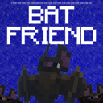

# 🦇 Bat Friend!
**(Mod ID: `tameabat`)**

Turn Minecraft's ambient cave-dwellers into loyal companions. Bat Friend lets you tame, perch, and explore alongside your very own bat buddy.

---

## ✨ Core Feautures

* **Taming:** Offer wild bats some honeycomb to win their trust and earn a loyal winged ally!
* **Night Vision:** When your loyal bat is nearby they will empower you with their night vision.
* **Relax or go CRAZY:** When leashed you can feed your bat a spider-eye to relax or some sugar to make them go crazy!
* **Make them yours:** Dye their collars to make them uniquely yours.

---

### 𓍯 Follow Mechanics
* Your loyal companion will always follow you until you attach them with a lead to a wall/fence.

### ❤︎ Healing
* Heal your bat who now has 9 hearts instead of 3 by feeding it a honeycomb! (2 hearts per honeycomb)

### 🧣 Collars
* Every tamed bat gains a collar, every dye can be used to change its color.

---

### 📦 Dependencies
* [Fabric API](https://modrinth.com/mod/fabric-api) (Required)
